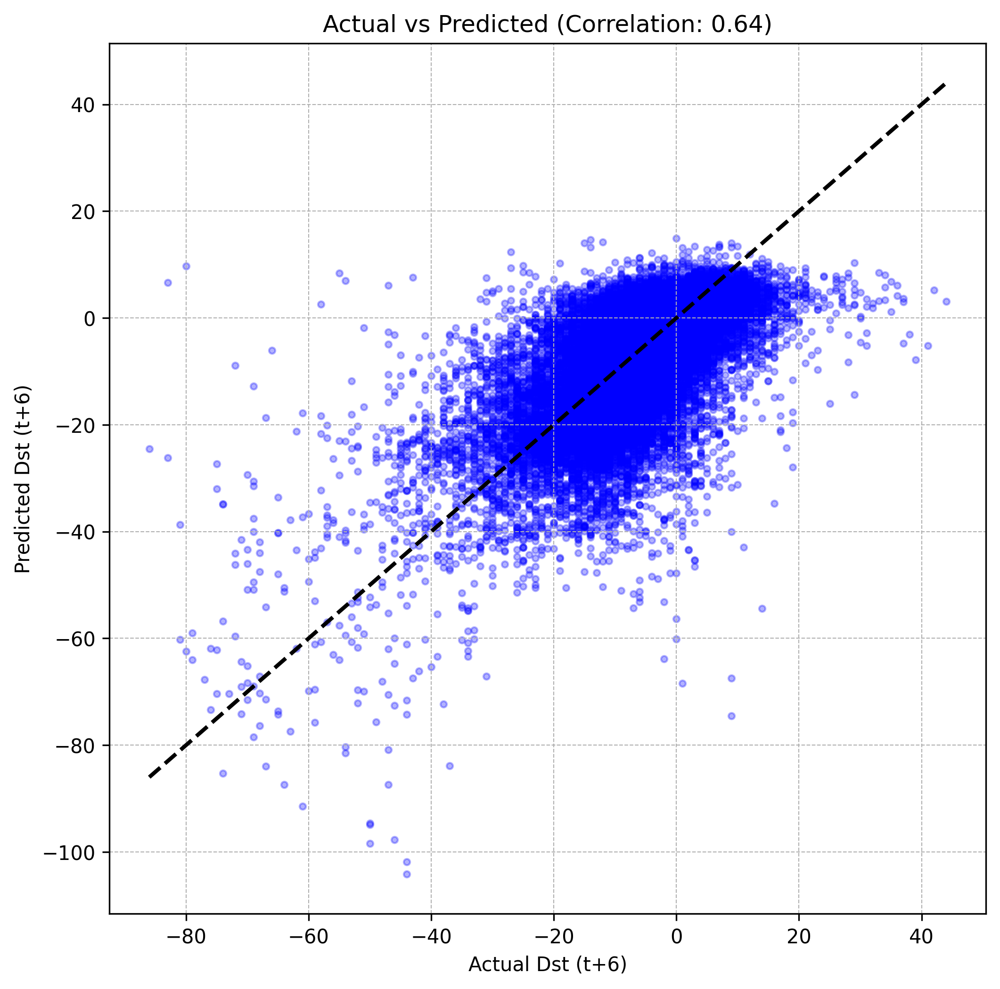

# Project Report: Solar Wind Dst Index Prediction

## 1. Introduction
Space weather has a direct impact on modern technological infrastructure. Geomagnetic storms, caused by the interaction of the solar wind with the Earth's magnetic field, can induce currents in power lines, disrupt satellite electronics, and interfere with radio communication. The Dst (Disturbance Storm Time) index is the primary metric used to track the intensity of these storms. This project focuses on using deep learning to predict this index to provide advanced warnings.

## 2. Aim of the Project
The main objective of this work is to build a machine learning model that can predict the Dst index 6 hours into the future. By providing a 6-hour lead time, we aim to create a functional early warning system that allows stakeholders to take preventive measures before a storm reaches its peak intensity.

## 3. Dataset Details
The dataset consists of solar wind parameters collected at the L1 Lagrangian point. 
- **Features:** The raw data includes Bx, By, Bz (Magnetic field components), Bt (Total field), Speed, Density, and Temperature.
- **Target:** The Dst index (nT).
- **Time Resolution:** The data was resampled to an hourly frequency using the mean of samples within each hour.
- **Data Splitting:** A 80/20 chronological split was used. This ensures that the model is trained on past data and tested on future data, which is the only correct way to validate a time-series model.

## 4. Methodology and Feature Engineering
To improve the model's physical understanding of the data, we added engineered features:
- **Energy Transfer Proxy:** Calculated as the product of Solar Wind Speed and the Bz component. This represents the rate at which solar energy enters the magnetosphere.
- **Rolling Averages:** We added 3-hour rolling means for Bz and Speed to help the model identify sustained solar conditions that usually lead to major storms.

## 5. Model Architecture
We implemented a Deep Learning model called `SolarAttentionLSTM`. 
- **LSTM Layers:** Two layers of Long Short-Term Memory units were used to capture the temporal dependencies in the 24-hour input sequence.
- **Attention Mechanism:** A custom attention layer was added. It allows the model to look back at the 24-hour window and identify which specific hour had the most significant impact on the future Dst value.
- **Output Layer:** The model outputs a vector of 6 values, representing the forecast for the next 6 hours.

## 6. Training and Optimization
- **Asymmetric Weighted Loss:** A standard MSE loss often fails to predict rare storm events because it focuses too much on the "quiet" time. We modified the loss function to penalize errors during storm times (Dst < -20) five times more than quiet times.
- **Regularization:** We used a Dropout rate of 0.4 and Weight Decay to prevent the model from overfitting.
- **Early Stopping:** Training was stopped automatically when the validation loss stopped improving, ensuring the best possible generalization.

## 7. Results and Discussion
The model demonstrates a high correlation between the predicted and actual Dst values. 
- **Forecasting Lead Time:** The model successfully predicts the downward trend of a storm 6 hours before it happens.
- **Magnitude Accuracy:** Thanks to the weighted loss function, the model is now capable of predicting the peak intensity of storms, which was a major challenge in earlier versions.
- **Validation:** Visual plots of the "strongest storm" in the validation set show that the model tracks the storm's entry and recovery phases accurately.
- **RMSE:** 9.5449 nT
- **Pearson Correlation:** 0.6436
- **R-Squared:** 0.2527

## 8. Conclusion
In this project, we have successfully developed a deep learning-based early warning system for space weather. By combining LSTM networks with attention mechanisms and physics-based features, we have created a tool that provides reliable 6-hour forecasts. This approach proves that deep learning can be a powerful asset in the field of heliophysics.
