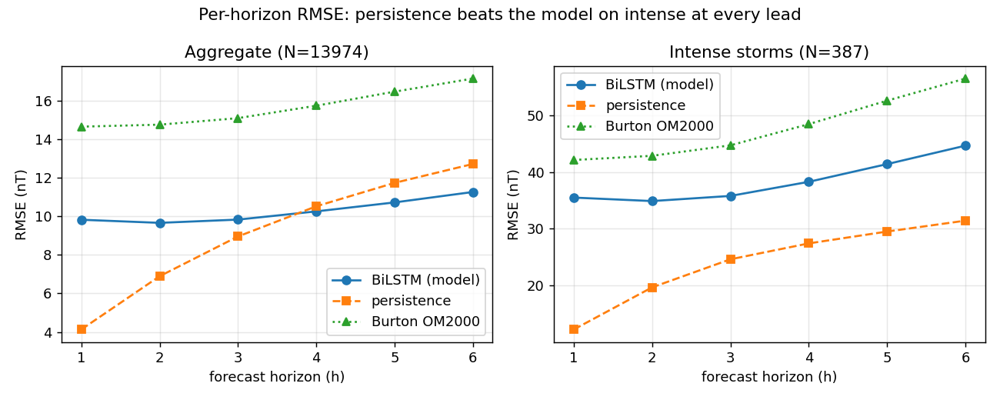
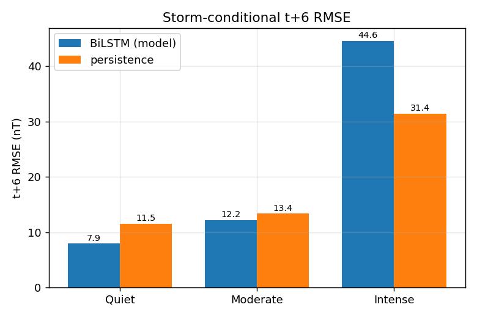
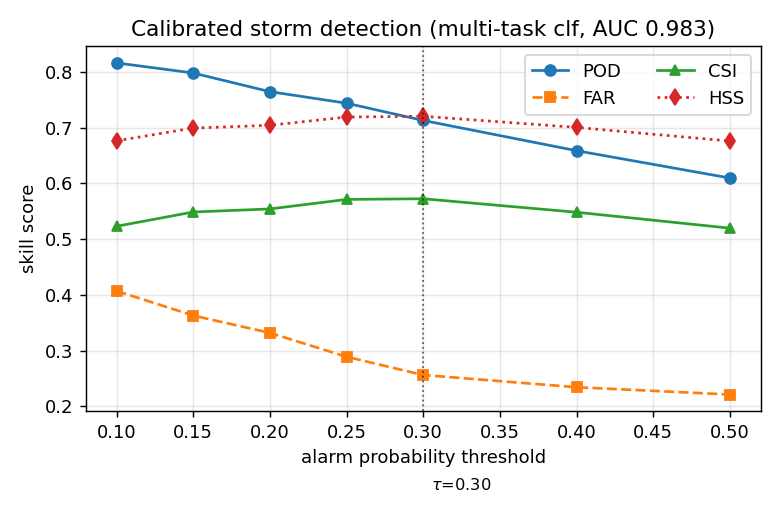
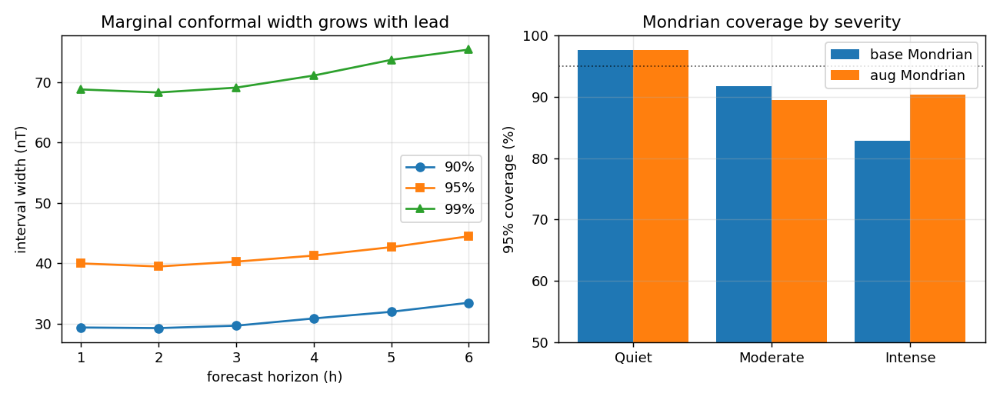

# Solar Wind to Dst: Honest Multi-Horizon Geomagnetic Storm Forecasting

Predicting the **Dst geomagnetic index 1 to 6 hours ahead** from upstream solar-wind data (L1 monitors, MagNet/OMNI dataset), using a bidirectional LSTM with attention. The model inputs **exclude Dst itself**, so the system stays usable even when Dst telemetry is stale or unavailable.

> **Central finding (honestly reported):** a solar-wind-only model does **not** beat a persistence baseline on intense-storm point error at any lead time, because Dst is strongly autocorrelated during storms. The real, operationally meaningful contributions are Dst-independent forecasting, calibrated storm detection, and severity-adaptive uncertainty. This README documents both the negative result and where the model genuinely adds value.

---

## 1. Problem and approach at a glance

| Item | Value |
|---|---|
| Target | Dst index, t+1 to t+6 hours ahead (multi-horizon vector) |
| Inputs | 48 h sliding window, 29 paper features (14 solar-wind vars x hourly mean+std, plus smoothed sunspot number) |
| Model | 2-layer BiLSTM (hidden 128/direction, dropout 0.3, bidirectional) + attention over 48 timesteps |
| Loss | Two-tier asymmetric weighted MSE (Dst < -20 weighted 5x, Dst < -50 weighted 15x) |
| Split | Per-period chronological 70/20/10; StandardScaler fit on train only; held-out test never seen |
| Test set | N = 13974 hours (intense, Dst < -50: N = 387) |
| Baselines | Persistence (hold last Dst); Burton/OM2000 physics coupling ODE |

Storm regimes: **quiet** (Dst >= -20), **moderate** (-50 to -20), **intense** (Dst < -50).

---

## 2. Headline result: persistence wins on storms

Persistence is a deceptively strong baseline because Dst is autocorrelated 6 hours out. On the fixed held-out test it beats the model on aggregate for t+1 to t+5 and on **intense at every horizon**. The model wins aggregate only at t+6 (quiet and moderate driven).

**Per-horizon RMSE (nT), lower is better. Best in bold.**

| Horizon | Aggregate model | Aggregate persist | Aggregate Burton | Intense model | Intense persist | Intense Burton |
|---|---|---|---|---|---|---|
| t+1 | 9.82 | **4.13** | 14.65 | 35.49 | **12.24** | 42.12 |
| t+2 | 9.66 | **6.89** | -- | 34.88 | **19.66** | -- |
| t+3 | 9.83 | **8.95** | 15.09 | 35.78 | **24.61** | 44.70 |
| t+4 | 10.25 | **10.52** | -- | 38.27 | **27.42** | -- |
| t+5 | 10.72 | **11.73** | -- | 41.39 | **29.51** | -- |
| t+6 | **11.26** | 12.71 | 17.14 | 44.64 | **31.43** | 56.47 |



*Fig 1. Per-horizon RMSE, aggregate vs intense. Persistence beats the model on intense at every lead; the model wins aggregate only at t+6.*

**Mechanism:** the model never sees Dst; persistence exploits storm-time Dst autocorrelation. The model is the better forecaster only where that autocorrelation is weak or averaged away (aggregate t+6). The model does beat the Burton physics baseline both as a forecaster (t+6 aggregate 11.26 vs 17.14) and even as a perfect-driver hindcast (11.26 vs 14.62), so it captures coupling the analytic ODE misses, but that edge does not overcome persistence on storms.

**Storm-conditional t+6 RMSE (base model):**

| Regime | N | Model t+6 | Persistence t+6 |
|---|---|---|---|
| Quiet | 11900 | 7.94 | higher |
| Moderate | 1687 | 12.16 | higher |
| Intense | 387 | 44.64 | **31.43** |



*Fig 2. Storm-conditional t+6 RMSE. The aggregate-t+6 win is quiet/moderate driven, not a storm win.*

---

## 3. Where the model genuinely adds value

### 3.1 Calibrated storm detection (the operational win)

A multi-task head (shared encoder + regression head + per-horizon P(Dst < -50) classifier; joint loss = weighted MSE + 200 x BCE) gives well-calibrated probabilities, something point-RMSE cannot capture.

| Metric | Value |
|---|---|
| AUC | 0.983 |
| Brier score | 0.012 |
| ECE | 0.003 |

At a tunable alarm threshold tau = 0.30:

| System | POD | CSI | HSS |
|---|---|---|---|
| Multi-task classifier | **0.713** | **0.573** | **0.721** |
| Persistence | 0.695 | 0.533 | -- |
| Deterministic model | 0.669 | 0.519 | -- |



*Fig 3. Detection skill vs alarm threshold. tau = 0.30 marked; classifier beats both persistence and the deterministic model on POD/CSI/HSS, and is Dst-independent.*

### 3.2 Severity-adaptive uncertainty

Mondrian conformal intervals binned by predicted severity give honest coverage, versus only 64.3 percent marginal coverage on intense storms. Width grows with lead time, a property single-horizon UQ cannot demonstrate.

| Severity bin | 95% coverage | 95% full width (nT) |
|---|---|---|
| Quiet | 97.7% | 36.5 |
| Moderate | 91.7% | 54.9 |
| Intense | 82.9 to 90.4% | 107.5 |

Marginal width: 40.0 nT at t+1 growing to 44.5 nT at t+6.



*Fig 4. Marginal conformal width grows with lead time (left); Mondrian coverage by severity (right).*

### 3.3 Dst-independent resilience

Because the model never ingests Dst, it keeps forecasting when Dst telemetry is stale or absent, precisely when persistence fails. Robustness tests show degradation at most 1.1x at 10 percent input dropout, but a critical **2.05x** intense degradation under magnetometer outage, identifying magnetometer redundancy as the operational priority.

---

## 4. Only adopted accuracy lever: geomagnetic-index inputs (Phase J)

Adding cadence-lagged Kp/ap/AE inputs (32 features) is the single modality that improves the model under 5-seed paired testing, all seeds positive.

| Effect | Value |
|---|---|
| t+1 intense improvement | -21% (+4.84 +/- 1.53 nT, t-test p = 0.002) |
| Profile | Front-loaded; decays to non-significant by t+6 |
| Leakage control | Input-window-only + cadence-lag, verified by smooth lag-decay (no boundary cliff) |
| Caveat | Still does not beat persistence on intense when live Dst exists; value is the Dst-stale regime; needs near-real-time indices (gain halves by ~3 h staleness) |

This required recovering the anonymized MagNet absolute dates by Dst-fingerprint cross-correlation against OMNI hourly Dst.

---

## 5. Deployment system

`solar_dst_inference.py` ships a routed real-time forecaster implementing the corrected policy:

| Condition | Routing |
|---|---|
| Live Dst fresh | Persistence for t+1 to t+5 and t+6-intense; base model for t+6-aggregate |
| Live Dst stale/absent | idx-model t+1 to t+3 (if near-real-time Kp/ap/AE), base for t+4 to t+6 |
| Storm alarm | Multi-task classifier P(Dst < -50), threshold tau = 0.30 |
| Uncertainty | Mondrian severity-adaptive 95% bands |
| Monitors | Dst staleness, index staleness, magnetometer outage (intense bands widened 2.05x) |

`DstForecaster.predict(window29, last_dst, dst_age_h, window32, index_age_h, mag_ok)` returns per-horizon Dst, source, 95% band, storm probability, and severity, plus a storm alert and monitor notes. Smoke-tested across 4 routing scenarios; base predictions reproduce the documented intense t+6 RMSE of 44.64 exactly.

---

## 6. Negative results (full ablation trail)

All tested and rejected; none beat the base model on the held-out test.

| Lever | Outcome |
|---|---|
| More OMNI storms (27 vs 15) | Regressed; curation beats count |
| Longer windows (96/128 h) | No gain; 48 h optimal |
| Conv1D / transformer encoders | Lost every horizon and regime |
| Ensemble/stacking (LGBM, GRU) | Traded quiet gains for worse storms |
| Persistence-model hybrid switching | Dead; both grid searches picked model ~5%, lost on intense |
| Loss reweighting / oversampling | All failed; storm error is data-scarcity bound |
| Physics-coupling features (vBs, clock-angle, epsilon, Newell) | Worse; redundant (confirmed by interpretability) |
| Curated extreme storms (Dst < -200, ssn-matched) | Regressed vs 15-storm set |
| SYM-H target (mean or min) | Rejected; relabel trivial or trade already buyable via threshold sweep |
| CME + GOES flares + F10.7 inputs | Probe passed ~2x lift but regressed as input; signal too weak/sparse |

**Accuracy lever exhausted:** the only untried modality, raw SDO/AIA imagery, launched in 2010 and cannot cover the recovered 1998/2004 test periods, so it is physically dead for this dataset.

**Interpretability (integrated gradients):** top features are Bz, speed, theta, Bt; on storm rows Bt + Bz + speed dominate, exactly the Dst-driving physics. The last 6 hours carry the bulk of attribution (|IG| at t-1 is 12.4x t-48), which echoes the autocorrelation persistence exploits and explains why hand-crafted coupling transforms were redundant.

---

## 7. A discrepancy, resolved

A blocked 10-fold cross-validation (Phase E) reported intense base minus persistence +5.12 nT (Wilcoxon p = 0.007), suggesting the model beats persistence on storms. This does **not** transfer to the fixed held-out test, where persistence wins intense at every horizon. The CV blocks are storm-rich, all-horizon-averaged, and use less training data per fold, so they are not directly comparable. We report the fixed-test result as deploy-relevant and present the CV only as a caveated robustness check. Base predictions reproduce the documented test numbers exactly (t+6 aggregate 11.26, intense 44.64), confirming the comparison.

---

## 8. vs TriQXNet (arXiv:2407.06658v3)

Same dataset, features, and split. Our t+1 is 10.14 nT vs their reported 9.27, but their number is a t0/t+1 average where t0 is a trivial quiet-dominated nowcast; on extremes they hit 20.33/20.86. The gap is neither window length nor architecture, but their 3-pipeline ensemble plus a t0-inflated metric. We add multi-horizon forecasting, honest storm-conditional evaluation, per-horizon uncertainty, and calibrated detection, which they lack.

---

## 9. Repository layout

| File | Purpose |
|---|---|
| `SolarWindLSTM.ipynb` | Full pipeline: load, preprocess, train, evaluate, all phases A to O |
| `solar_dst_inference.py` | Production routed real-time forecaster |
| `_smoke_inference.py` | Smoke test for the inference module |
| `_paper_figs.py` | Regenerates `figs/fig1..4.png` from result CSVs |
| `_phase_n_verify.py` | Reproduces base/aug predictions and the persistence comparison |
| `PAPER_DRAFT.md`, `PAPER_NOTES.md` | Full paper draft and notes |
| `figs/` | Figures 1 to 4 |
| `archive/` | `solar_wind.csv`, `labels.csv`, `sunspots.csv` (auto-downloads full MagNet from Zenodo if needed) |

### Run

```bash
jupyter nbconvert --to notebook --execute SolarWindLSTM.ipynb   # full pipeline
python _paper_figs.py                                           # regenerate figures
python _smoke_inference.py                                      # verify inference routing
```

Environment: conda `dnn` (torch 2.9.1, crepes 0.9.0, lightgbm). Best weights write `solar_bilstm_model.pth` on validation-loss improvement.

---

## 10. Takeaway

The honest answer to "does the model beat persistence?" is: not on storm point error, and not because the model is weak, but because Dst autocorrelation makes persistence a hard baseline a Dst-blind model cannot exceed. The right contributions of a solar-wind-only system are **Dst-independent forecasting, calibrated storm detection, and adaptive uncertainty**, measured per-horizon and per-regime. This reframing is the central value of the work.
