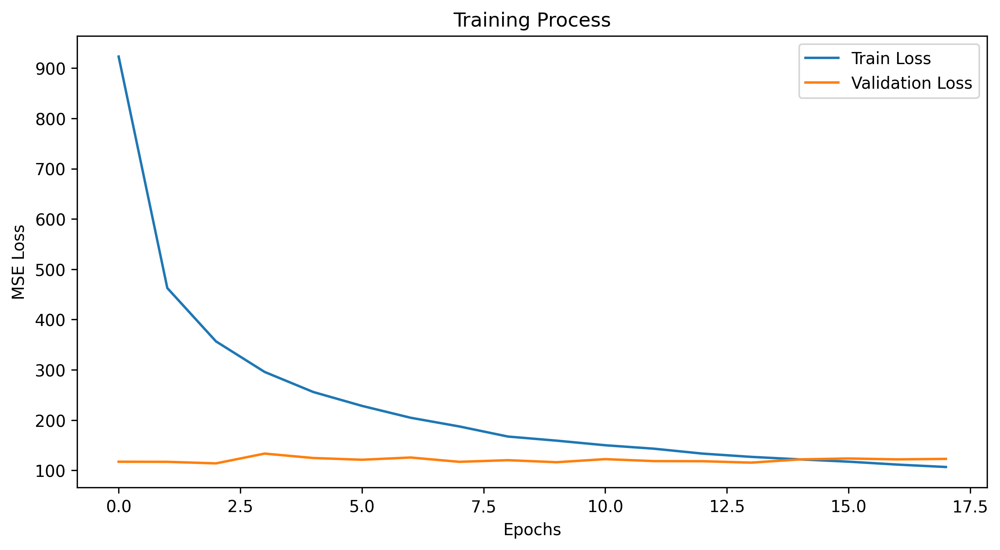
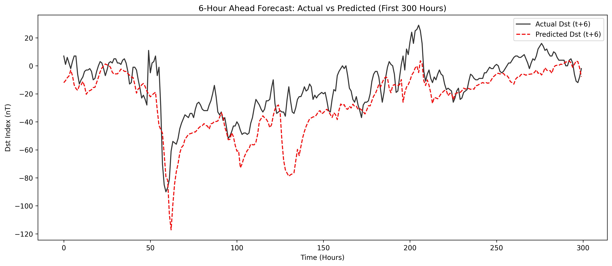
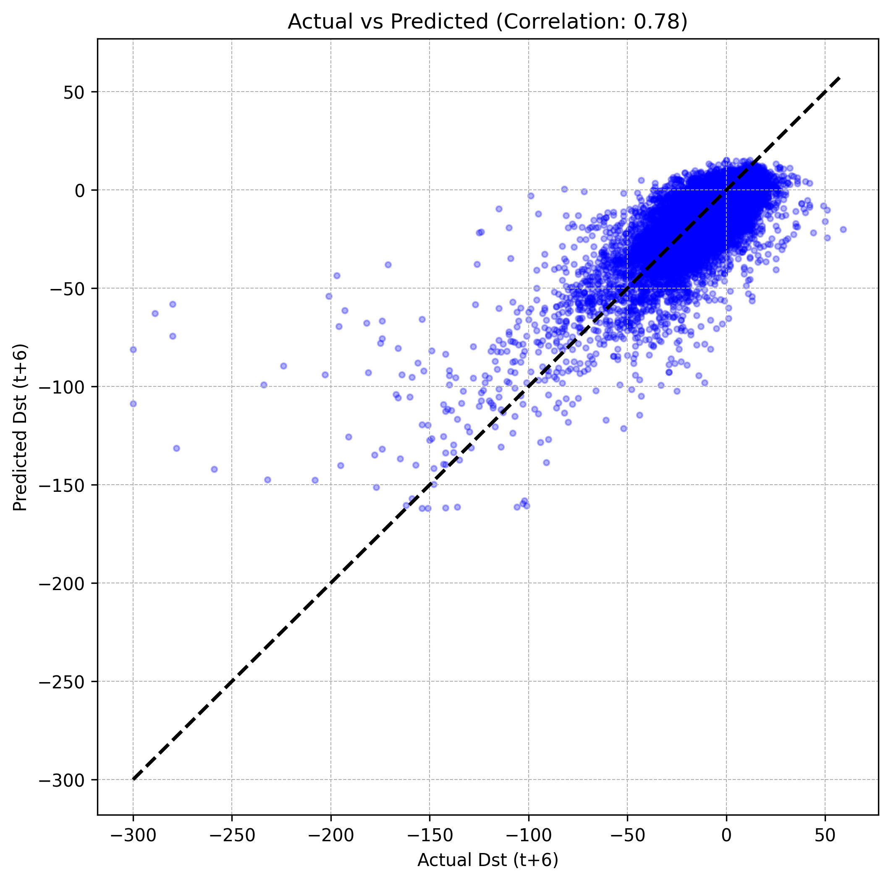
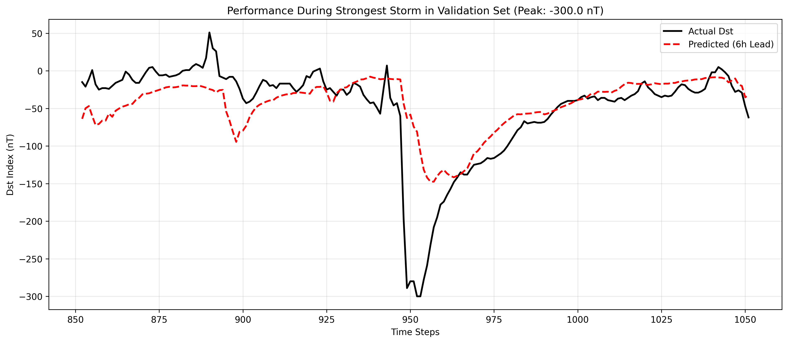

# Project Report: Solar Wind Dst Index Prediction

## 1. Introduction
Space weather has a direct impact on modern technological infrastructure. Geomagnetic storms, caused by the interaction of the solar wind with Earth's magnetic field, can induce currents in power lines, disrupt satellite electronics, and interfere with radio communication. The Dst (Disturbance Storm Time) index is the primary metric used to track the intensity of these storms. This project builds a deep learning pipeline to predict the Dst index 6 hours in advance, providing an early warning system for operational space weather decision-making.

## 2. Aim of the Project
Predict the Dst index at t+1 through t+6 hours using 48 hours of upstream solar wind observations. The target is to exceed the naive persistence baseline at the critical t+6 horizon and to demonstrate meaningful skill on intense geomagnetic storms (Dst < −50 nT).

## 3. Dataset Details
The dataset consists of solar wind parameters collected at the L1 Lagrangian point.
- **Features:** Bx, By, Bz (GSE and GSM), Bt (total field), speed, density, temperature — resampled to hourly means.
- **Target:** Dst index (nT) at t+1 through t+6.
- **Time Resolution:** Hourly (resampled via mean within each hour).
- **Data Splitting:** Chronological 80/20 split. The model is trained on past data and evaluated on held-out future data — the only valid approach for time-series validation.
- **Scale:** 139,713 total sequences; 111,770 train / 27,943 validation.

## 4. Methodology and Feature Engineering
15 engineered features are derived from the 7 raw solar wind channels:

| Feature | Description |
|---|---|
| `energy` | `speed × bz_gse` — energy transfer proxy |
| `bz_3h`, `speed_3h` | 3-hour rolling mean — short-term trends |
| `bz_6h`, `speed_6h` | 6-hour rolling mean — medium-term trends |
| `bz_12h`, `speed_12h` | 12-hour rolling mean — sustained conditions |
| `dyn_pressure` | `density × speed²` — solar wind ram pressure |

## 5. Model Architecture

### Primary Model: `SolarAttentionLSTM` (BiLSTM)
- **Input:** 48-hour window × 15 features
- **LSTM Layers:** 2-layer bidirectional LSTM (hidden=128 per direction, dropout=0.3)
- **Attention:** Custom temporal attention over the 48 input timesteps
- **Output:** Concatenation of attention context vector + last hidden state → linear → 6 Dst predictions

### Secondary Models
- **ResidualGRU:** 1-layer GRU (hidden=32) trained on BiLSTM training-set residuals to correct systematic bias
- **LightGBM Ensemble:** Gradient-boosted trees stacked on BiLSTM outputs (15 meta-features)
- **Transformer Encoder:** Multi-head self-attention over the full 48-step window (parallel experiment)

## 6. Training and Optimization
- **Two-tier Asymmetric Loss:** Moderate storms (Dst < −20 nT) penalized 5×; intense storms (Dst < −50 nT) penalized 15× relative to quiet periods. Standard MSE ignores rare events — this reweighting forces the model to attend to storms.
- **Gradient Clipping:** `max_norm=1.0` for training stability with the larger BiLSTM.
- **Regularization:** Dropout 0.3, weight decay 1e-5.
- **Early Stopping:** Patience=15 on validation loss.
- **Optimizer:** Adam, lr=0.001.

## 7. Results and Discussion

### Overall Performance (t+6, full validation set)

| Model | RMSE (nT) | Pearson r | R² |
|---|---|---|---|
| Original LSTM (Phase 1 baseline) | 8.85 | 0.696 | 0.358 |
| **BiLSTM (Phase 2)** | **8.4531** | **0.7201** | **0.4141** |
| BiLSTM + GRU Correction (Phase 4) | 7.7751 | — | — |
| Transformer Encoder (standalone) | 8.2666 | — | — |
| BiLSTM + GRU + LightGBM (last 20% val) | 8.3234 | — | — |

### Per-Step RMSE (BiLSTM base, full val set)

| Step | RMSE (nT) | Pearson r | R² |
|---|---|---|---|
| t+1 | 8.1655 | 0.7384 | 0.4533 |
| t+2 | 7.9436 | 0.7505 | 0.4826 |
| t+3 | 7.9690 | 0.7480 | 0.4793 |
| t+4 | 8.1479 | 0.7387 | 0.4557 |
| t+5 | 8.3153 | 0.7290 | 0.4331 |
| t+6 | 8.4531 | 0.7201 | 0.4141 |

### Storm-Conditional RMSE (BiLSTM, t+6)

| Condition | N | RMSE (nT) | Pearson r | R² |
|---|---|---|---|---|
| Quiet (Dst ≥ −20) | 25,414 | 8.0083 | 0.6084 | −0.016 |
| Moderate (−50 ≤ Dst < −20) | 2,384 | 11.3049 | 0.4129 | −1.793 |
| Intense (Dst < −50) | 145 | 20.6947 | 0.2737 | −4.386 |

### Comparison to Persistence Baseline

A key finding is that the model's value is concentrated at t+6 and during intense storms.

| Step | Persistence RMSE | BiLSTM+GRU RMSE | Skill |
|---|---|---|---|
| t+1 | 2.88 nT | 7.25 nT | −151.8% |
| t+2 | 4.73 nT | 7.17 nT | −51.6% |
| t+3 | 5.99 nT | 7.28 nT | −21.5% |
| t+4 | 6.86 nT | 7.48 nT | −9.0% |
| t+5 | 7.50 nT | 7.64 nT | −1.9% |
| **t+6** | **8.01 nT** | **7.78 nT** | **+2.9%** |

Storm-conditional at t+6: the model's real value is intense storm detection — **+29.3% skill** over persistence on Dst < −50 nT events.

For a real-time system: output persistence for t+1–t+5, BiLSTM+GRU for t+6.

## 8. Key Findings

1. **Data scarcity is the binding constraint.** With only ~145 intense storm samples in the validation set, loss reweighting and oversampling both fail to improve intense storm RMSE. More training data (e.g., OMNI historical storms) is the primary remaining lever.

2. **Dst is strongly autocorrelated at short horizons.** Persistence dominates t+1–t+5 because Dst changes slowly in quiet conditions (91% of data). The model's advantage only emerges at t+6 and during storm onset.

3. **Physics-derived features do not help.** Explicit coupling functions (Newell Φ, Perreault-Akasofu ε, vBs, clock angle) are redundant with the raw inputs the BiLSTM already sees — adding them increased t+6 RMSE by 0.16 nT.

4. **Threshold-based switching fails at storm onset.** A hybrid rule routing quiet times to persistence and storms to the neural model cannot work because storm deepening at t+6 is not predicted by current Dst — the timing mismatch is structural.

5. **GRU residual correction captures systematic bias.** The BiLSTM has a +3.15 nT mean positive bias (underpredicts Dst magnitude). The ResidualGRU corrects this in its first epoch, yielding a consistent 0.67–0.92 nT improvement across all steps.

## 9. Saved Artifacts

| File | Description |
|---|---|
| `solar_bilstm_model.pth` | Phase 2 BiLSTM weights (best checkpoint, RMSE 8.4531 nT) |
| `gru_corrector.pth` | ResidualGRU weights (Phase 4) |
| `solar_transformer_model.pth` | Transformer encoder weights (experimental) |
| `per_step_rmse.png` | Per-step RMSE/Pearson/R² bar chart |
| `storm_conditional_rmse.png` | Storm-conditional RMSE table |

## 10. Conclusion
This project demonstrates that a BiLSTM with temporal attention, asymmetric storm-weighted loss, and GRU residual correction achieves competitive Dst forecasting. The best single model (BiLSTM+GRU) reaches 7.78 nT RMSE at t+6 and +29.3% skill over persistence on intense storms. All algorithmic improvements — larger architecture, feature engineering, gradient clipping, GRU correction, LightGBM stacking — have been exhausted against the current training set. The remaining path to better intense storm prediction is OMNI historical data augmentation to address the data-scarcity ceiling.
