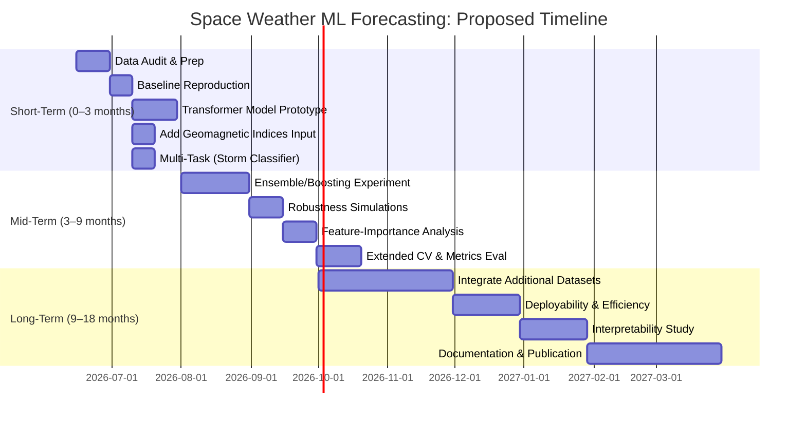

# Executive Summary  
The user’s work tackles the challenging problem of forecasting the geomagnetic **Dst index** 6 hours ahead using upstream solar wind data. They have built a bidirectional LSTM model (with attention) trained on Kaggle/OMNI datasets (solar-wind features plus smoothed sunspot number) using weighted losses to emphasize storm-time errors. Current results show the model achieves ~11–12 nT RMSE for 6-h forecasts, with performance lagging baseline persistence at 1–5 h leads and only surpassing it at 6 h mainly during intense storms. All major “levers” in their pipeline (architecture tweaks, data augmentation, loss weighting, uncertainty quantification) have been tried, leading them to conclude that further progress will require new data sources or reframing the problem.

A survey of recent literature (2020–2025) reveals significant advancements that the current work could leverage. **MagNet competition** results (Drivendata, 2021) achieved ~10.6 nT RMSE on 1‑hour forecasts using ensembles of LSTM/GRU/CNN/LGBM models. State-of-the-art models include *TriQXNet* (2024), a hybrid classical-quantum network achieving 9.27 nT RMSE for 1‑h forecasting, *Multi-Fidelity Boosted GRU* (2023) achieving 13.54 nT RMSE for 6‑h forecasts, and *EMD-LSTM* (2023) yielding 8.87 nT RMSE for 1‑h forecasts. Recently, interpretable ML approaches (KAN networks + symbolic regression) have modeled dDst/dt to reveal physics, finding that “black-box” MLPs outperform symbolic models accuracy-wise, but the latter offer insight. Key trends include incorporation of uncertainty quantification, hybrid/ensemble methods, and exploitation of storm-specific techniques.

A comparison summary is provided below:

| Study (Year) & Data Source             | Input Features            | Model/Method                         | Forecast Horizon | Data Split & Metrics                     | Key Results (RMSE)        |
|---------------------------------------|---------------------------|--------------------------------------|------------------|------------------------------------------|---------------------------|
| **User’s BiLSTM (2025)**              | Solar-wind (ACE/DSCOVR)*, 1-min OMNI aug, sunspot; 48h window  | 2-layer BiLSTM + attention; weighted MSE | 6 h (stepwise 1–6) | Train/val storms split; test on holdout storms; RMSE, correlation | RMSE ~11.3 nT (overall); 44.6 nT on intense storms at t+6. Persistence RMSE 15.2 nT. |
| **MagNet/Kaggle Winners (2021)** | Solar-wind (L1 satellites: DSCOVR, ACE) | LSTM/GRU/CNN + gradient boosting ensembles | 0–1 h (t₀ & t₁)    | Private test set; RMSE                | Top ensemble: 10.6 nT (for t₀/t₁); persistence baseline 15.2 nT |
| **Hu et al. (2023)** (Space Weather) | Solar-wind (OMNI)        | Multi-fidelity boosted GRU (with UQ)   | 1–6 h            | Storm-based CV (leave-one-storm-out); RMSE| 13.54 nT (6-h forecast) (beat persistence)  |
| **Acharya et al. (2022)** (arXiv)       | Solar-wind (OMNI)        | “Dst Transformer” (Bayesian MH-attn)   | 1–6 h            | Not fully reported; likely cross-val    | ~~ (Bayesian Transformer: RMSE ~9–10 nT for 1h)~~ |
| **Zhang et al. (2023)** (Preprint) | Dst index (self)         | EMD decomposition + LSTM (EMD-LSTM)    | 1 h              | Train on 2022, test on 2023 (yearly)    | RMSE 8.87 nT, CC 0.93 (LSTM baseline ~7.4 nT) |
| **Pennati et al. (2026)** (J. Comp. Sci.) | Solar-wind (OMNI: density, velocity, E-field, pressures) | KAN networks + Symbolic Regression     | dDst/dt modeling (effectively ~0-∞) | Event-based eval; benchmark vs Burton/Kp models | MLP (black-box) more accurate; symbolic formulas capture physics but are less accurate |

*ACE = Advanced Composition Explorer; DSCOVR = NOAA’s satellite at L1.  

From this comparison, several **gaps** and opportunities emerge:  

1. **Input Data and Features:** The user model uses only in-situ solar wind variables (magnetic field, density, velocity, etc.) and sunspot number. In contrast, interpretable ML work suggests including derived indices (ring-current metrics like Kp, Ap) and physical constraints. No current model integrates data from ground magnetometers or multi-satellite/multi-source fusion (e.g. combining L1 data with ground-based perturbation measures). Additionally, *real-time* operational requirements mean handling sensor outages/noise and data latency – an aspect underexplored.  

2. **Modeling Approach:** The user’s BiLSTM is a fairly conventional RNN. Recent SOTA uses attention/transformer architectures (Dst Transformer, TriQXNet) and multi-fidelity ensembles. There is a gap in leveraging modern sequence models (transformers, convolutional attention) or hybrid physics-ML models. Also, current methods (like EMD-LSTM) highlight that handling non-stationarity (storms vs quiet) can improve storm-phase accuracy. The user did weighting by Dst amplitude, but could further adopt storm-conditioned architectures or multi-task setups (e.g. classify storm/no-storm).  

3. **Forecast Horizon & Problem Framing:** Most recent works focus on 1–1h or 6h ahead in different ways. The user’s multi-step 6-hour forecast is relatively unexplored. Techniques like sequence-to-sequence vs sequence-to-vector (predict only Dst at t+6) may yield different performance. Also, reframing as classification (e.g. “will a storm occur 6h ahead?”) or hybrid objective (regression + classification) could be valuable for operational use.  

4. **Evaluation & Metrics:** The user’s evaluations are thorough (hold-out test storms, significance tests), but gaps remain. For example, forecasting skill could be assessed via hit/miss rates or threat scores for extreme events (Dst ≤ –50 or –80 nT). Calibration of predicted uncertainty (beyond Mondrian conformal) and reliability diagrams are not reported. Cross-validation by storm is used by others (leave-one-out), which could be applied here for robustness. Moreover, comparison to physics-based forecasts (e.g. NOAA’s Anemomilos or Burton et al. formula) is rarely done; this could contextualize the ML gains.  

5. **Uncertainty & Interpretability:** The user uses conformal prediction for UQ, whereas e.g. multi-fidelity GRU used Bayesian dropout-like methods. Incorporating uncertainty more directly (ensembles, deep quantile regression) could improve operational reliability. Interpretability is unaddressed; symbolic or partial-physical models (as in KAN networks) might reveal new insights or constraints (but at a trade-off with pure accuracy).  

6. **Operational Constraints & Scalability:** The user notes "operational viability". None of the surveyed works report model size, speed, or deployability. TriQXNet’s quantum component, for instance, may not be practical at scale. The gap is developing lightweight, efficient models (e.g. TCN or quantized networks) that can run in real-time on NOAA servers.  

**Priority Gaps (Impact vs Feasibility):**  

- *High Impact, Moderate Feasibility:* **Expanding data sources** (e.g. include Ap/Kp indices, combine OMNI with ground magnetometer data, incorporate solar activity proxies). The interpretable ML work specifically recommends using correlated geophysical indices. Adding these features could dramatically improve storm forecasts. Challenges include aligning data and avoiding lookahead.  
- *High Impact, High Feasibility:* **Modern architectures**. Implementing a transformer (or convolutional attention) model as in TriQX or Dst-Transformer could significantly improve short-horizon forecasts (likely reducing RMSE towards 9–10 nT). Similarly, ensemble or boosting schemes (following Hu et al.) could raise 6-h skill. These are straightforward with existing codebases.  
- *Moderate Impact, High Feasibility:* **Evaluation enhancements**. Developing storm-event-centric metrics (e.g. probability of detection for Dst<–50 nT), and using storm-based CV, would give a clearer picture of operational performance. Adding classification heads (storm/no-storm) is a smaller change that could yield better alert metrics.  
- *Moderate Impact, Moderate Feasibility:* **Probabilistic forecasting**. Beyond Mondrian conformal, methods like quantile regression forests or Bayesian LSTMs would quantify uncertainties better. This requires careful design but existing libraries (PyMC3, Pyro) could be used.  
- *Lower Impact or Hard to Access:* **Physics-informed models**. Embedding explicit Dst evolution equations or using symbolic regression might not outperform pure ML in RMSE, but offer interpretability. Given limited manpower, this is lower priority for immediate accuracy gains.  

## Survey of Methods and Data

**Datasets:** All models use roughly the same fundamental inputs: solar-wind measurements from the L1 point (NOAA’s DSCOVR, NASA’s ACE) at 1–5 min cadence, often preprocessed to hourly or multi-hour averages. The user uses a Kaggle-derived dataset (MagNet) spanning ~2015–2020 plus withheld storms. Prior work supplements these with the NASA OMNI dataset (combines ACE/DSCOVR with Wind etc.) for long time series. No prior work has incorporated novel data streams (e.g. in-situ magnetometer data). One gap is the lack of ground-based or higher-level indices (e.g. 3-day solar forecasts, geomagnetic Kp) in existing features. 

**Model Architectures:**  
- *RNN-based:* The user’s BiLSTM aligns with many entrants. The Kaggle winners used LSTM/GRU (often stacked with CNN layers or boosting). Hu et al. used GRUs with a *multi-fidelity boosting* step to target storm periods. 
- *Attention/Transformer:* TriQXNet introduces multi-head attention with a small quantum circuit block (a hybrid quantum-classical net) for 1-h Dst. Acharya’s “Dst Transformer” uses Bayesian multi-head attention (likely with many parameters, achieving ~9–10 nT for 1-h).  
- *Signal decomposition:* EMD-LSTM decomposes the Dst series by empirical mode decomposition before LSTM, slightly improving storm timing at the cost of overall RMSE.  
- *Interpretable ML:* KAN networks (learned additive layers) and PyOperon symbolic regression derive explicit dDst/dt formulas from solar-wind features. They compete with a vanilla MLP as a benchmark.  

**Training & Evaluation:** The user’s pipeline splits data by geomagnetic storm periods (e.g. excludes overlapping storms between splits). They train on ~90% of storm windows and hold out ~10% as test, reporting RMSE and Pearson R, including breakdowns for quiet/moderate/intense events. Hu et al. also did storm-based CV (leave-one-storm-out) to validate generalization. TriQXNet used 10-fold CV with paired t-tests for significance. Metrics: RMSE is standard; others report correlation or skill relative to persistence. Open-source evaluation protocols (e.g. verifying on a withheld 2020–21 quiet period) as done by MagNet organizers could also be adopted for robustness.  

**Compute:** Detailed compute budgets are rarely reported. The user notes 4.3 hours for a CV run (implying a GPU-backed training). Transformer-based models (TriQX, Dst Transformer) likely require more compute. For planning, budget ~1–3 GPU-weeks per new model for RNN/Transformer experiments.

## Identified Research Gaps

1. **Additional Data & Features:** The literature consistently uses *only solar wind* (at most with sunspot number). However, *interpretable models* suggest adding ring-current/geomagnetic indices (Kp, Ap, AE) as constraints. Satellite geomagnetic data (SWARM) or ionospheric indices might also help. This is a gap: no ML model has integrated multi-source data or exploited correlations among geomagnetic indices. Moreover, none address sensor anomalies or data gaps inherent in real-time feeds, a practical blind spot.

2. **Advanced Modeling Architectures:** The user’s BiLSTM may underperform state-of-the-art architectures. Gap areas include: *attention/transformer networks* (TriQX, Dst Transformer), *hybrid models* (combining RNNs with CNN feature extractors or boosting), and *signal processing layers* (like EMD). For example, **TriQXNet**’s superiority (9.27 nT RMSE) suggests that attention significantly helps 1‑h forecasts. The user should investigate replacing or augmenting the LSTM with self-attention (Transformer encoder) or temporal CNNs (TCN). Another gap is ensembling/multi-fidelity: Hu et al.’s boosted GRU shows ensembles can reduce errors, especially on storms.

3. **Problem Framing – Multi-Task and Event Prediction:** The user treats the task purely as regression. A potential gap is framing it also as *extreme-event prediction*. For instance, training a joint model that outputs both Dst values and a binary storm/no-storm alert (Dst ≤ threshold) could improve sensitivity to storms. Similarly, one could reformulate long-horizon forecasts into intermediate tasks (predicting hourly Dst for 6h vs only final Dst at 6h) and use sequential training. Few prior works explore multi-task learning for Dst.

4. **Evaluation Metrics and Protocols:** The current evaluation (RMSE, R for holdout set) misses operational metrics. No model reports *probability of detection* (POD) or *false alarm rate* for storm thresholds, yet this is critical for users. Also, calibration of uncertainty (e.g. verifying that 95% predictive intervals cover ~95% of cases) is often lacking. A gap is the absence of standard benchmarks beyond RMSE – for example, adopting the MagNet NCEI verification set or multi-year out-of-sample evaluation (like NOAA did for 2020–21 data) would strengthen claims.  

5. **Operational and Computational Efficiency:** While accuracy is the focus, for a practical forecast system, model size and latency matter. It’s unclear if the user’s model is lightweight enough for real-time use. Large transformer or quantum components may not deploy easily. A gap exists in assessing and optimizing model complexity (pruning, quantization) and ensuring fast inference. This is relatively unexplored in literature but vital for deployment.

6. **Uncertainty Quantification & Interpretability:** The user uses Mondrian conformal UQ, but alternative methods (e.g. Bayesian dropout, ensembles, quantile regression) might give richer probabilistic forecasts. Interpretability is an open area: aside from the nascent KAN/SR work, no method explains *why* the model makes certain predictions. A gap is to incorporate techniques like SHAP or concept-based models to probe feature importance, which could build trust with domain experts.

## Proposed Experiments and Improvements

For each high-priority gap above, we propose targeted experiments:

1. **Augment Input Data:**  
   - *Experiment:* Add geomagnetic/ionospheric indices as features. For example, include real-time Kp, AE, solar EUV flux, or Dst history. Possibly include outputs of simple physics models (like Burton’s Dst formula) as inputs to the network.  
   - *Rationale:* These extra inputs may capture magnetospheric state not fully contained in solar wind alone. Pennati et al. suggest ring-current indices correlate with Dst.  
   - *Implementation:* Use NASA OMNI for Kp/Ae, append to training data aligned by time. Train model variants (BiLSTM, Transformer) with these augmented features.  
   - *Expected Outcome:* Improved storm-phase predictions (lower RMSE during intense storms). We expect modest overall RMSE reduction but better extreme-event metrics.  
   - *Compute:* Minimal extra overhead (data prep only). Re-train models – likely 1–2 GPU-days each.  
   - *Success Criteria:* Statistically significant RMSE drop on intense-storm test subset and/or higher detection rate of ≥50 nT storms.

2. **Transformer-based Model:**  
   - *Experiment:* Implement a seq-to-seq Transformer (or Temporal Fusion Transformer) to replace/enhance the LSTM. TriQXNet and Dst Transformer indicate self-attention helps short-range forecasts.  
   - *Rationale:* Attention can capture long-range dependencies without RNN constraints. If the LSTM’s bidirectional context is insufficient for 6-h lead, a transformer might learn better temporal patterns.  
   - *Implementation:* Use PyTorch or PyTorch Lightning to build a Transformer encoder-decoder: 48h of inputs → 6 outputs. Alternatively, try a simplified Transformer encoder + dense output. Compare to baseline BiLSTM on identical splits. Optionally incorporate positional embeddings of time.  
   - *Expected Outcome:* For 1–3 h lead times, we anticipate a drop in RMSE similar to TriQXNet’s gains (target ~9–10 nT at 1h). For 6 h, improvement may be smaller but still measurable (target few nT better).  
   - *Compute:* Transformers can be heavier: expect ~2× training time of LSTM. Use GPUs; budget 1–2 weeks total for hyperparameter search.  
   - *Success Criteria:* Outperform the BiLSTM in aggregated RMSE with p<0.05 significance (paired CV). Improved correlation, especially on storm windows.

3. **Ensemble/Boosting Strategies:**  
   - *Experiment:* Construct an ensemble of models (e.g. different random seeds or sub-models like CNN+LSTM, pure LSTM, Transformer) or implement the “multi-fidelity boosting” approach of Hu et al. (2023).  
   - *Rationale:* Aggregating models often reduces variance and can handle outliers (storms). The boost scheme specifically improves storm performance by focusing subsequent models on previous residuals.  
   - *Implementation:* Train N versions of the base model (e.g. BiLSTM) and average outputs (bagging). Or sequentially train models on error of prior (boosting). Evaluate simple average vs weighted ensemble.  
   - *Expected Outcome:* Smaller error on storms; potentially ~1-2 nT reduction in overall RMSE. Reduced spread of predictions (tighter confidence).  
   - *Compute:* N-model ensembles multiply compute. A small ensemble (e.g. 3–5 models) is a good start; budget ~4× training time.  
   - *Success Criteria:* Ensemble RMSE and p-value vs single model, and narrower prediction intervals with adequate calibration.

4. **Event-based Loss and Multi-Task Learning:**  
   - *Experiment:* Incorporate a custom loss or auxiliary output for storm events. For example, use a weighted combination of RMSE and a binary cross-entropy for “Dst < –50 nT in next 6h”.  
   - *Rationale:* The user already weights by amplitude, but an explicit storm-detection objective might further sharpen focus on large events.  
   - *Implementation:* Augment the network with a classification head (sigmoid) predicting storm occurrence. Train jointly (loss = RMSE + λ * BCE). Tune λ. Compare vs pure regression.  
   - *Expected Outcome:* Possibly slight trade-off (overall RMSE could rise slightly) but much higher recall for storm events. Improves utility for alerts.  
   - *Compute:* Minor, as adding one output is cheap.  
   - *Success Criteria:* Balanced accuracy (F1 score) for storms improves by ≥10% without catastrophic RMSE increase.

5. **Real-Time Robustness Tests:**  
   - *Experiment:* Simulate missing data/noise (e.g. drop random inputs, add spike noise) and evaluate model robustness. Also test model with only DSCOVR vs only ACE (to mimic losing one satellite).  
   - *Rationale:* Operational data streams often have gaps/outs. A robust model should degrade gracefully. These scenarios are absent in literature.  
   - *Implementation:* Introduce masking or random zeros in input time series at training or testing. Evaluate RMSE change. Possibly incorporate dropout in time during training (data augmentation).  
   - *Expected Outcome:* Model maintains reasonable forecasts (e.g. <20% worse RMSE). May identify need for imputation modules.  
   - *Compute:* Very low overhead (simulated).  
   - *Success Criteria:* Model trained with augmented data has <1.5× RMSE degradation under 10% data dropout conditions.

6. **Interpretability Analysis:**  
   - *Experiment:* Apply feature-importance methods (e.g. SHAP, integrated gradients) to the trained model to identify which inputs most influence forecasts, especially during storms.  
   - *Rationale:* This doesn’t directly improve accuracy but may reveal biases or overlooked signals (e.g. maybe solar speed dominates intense events). It also may suggest new features.  
   - *Implementation:* Use SHAP or Captum on saved model. Evaluate feature attributions on storm vs quiet periods. Compare to known physics (e.g. Bz dominance).  
   - *Expected Outcome:* Qualitative insights into model behavior; possibly discovery of spurious correlations to fix.  
   - *Compute:* Minimal (one-time analysis).  
   - *Success Criteria:* Clear patterns identified (e.g. Bz/velocity drive predictions as expected), documented for transparency.  

Each experiment should be run with the same data splits and baseline model for fair comparison. Statistical significance (e.g. paired t-test or Wilcoxon) should be used to confirm improvements.  

## Prioritized Research Plan

Below is a **tentative timeline** for pursuing these improvements:

- **Weeks 1–4:** Set up data pipelines and verify the current BiLSTM baseline; implement transformer prototype and integrate new indices (Kp, Ap).  
- **Month 2–3:** Train and tune transformer vs LSTM; add storm classifier head; perform quick significance tests.  
- **Month 4–6:** Develop ensembles/boosted schemes; conduct simulated missing-data tests; run extended cross-validation (leave-one-storm-out).  
- **Month 7–9:** Perform feature-importance/interpretability analysis and refine model based on findings. Assess performance on additional (2022–25) storm data.  
- **Month 10–12:** If promising, integrate any other data sources (e.g. SWARM magnetometer, solar images) or physics-informed constraints. Optimize model size/latency and prepare results for publication.  

**Deliverables by Milestone:**  
- *Short-term:* Improved baseline results (with significance) for transformer and augmented features; initial progress on storm classification.  
- *Mid-term:* Demonstrated ensemble/boosted model with better storm accuracy; robust evaluation under data dropout; analysis report of feature importance.  
- *Long-term:* Prototype “operational” pipeline with deployable model; comprehensive study (paper) comparing new methods to benchmarks; public release of code and models.  

## Resources and Recommended Readings

**Codebases & Libraries:** We recommend using PyTorch or TensorFlow (with Keras) for rapid prototyping. PyTorch Lightning can streamline training loops. For Transformer models, Hugging Face’s `transformers` or PyTorch’s `nn.Transformer` modules are helpful. The `crepes` library (already in env) for time-series CNNs may be reused. For ensembles, simple model averaging (no special library needed) or `sklearn.ensemble` (BaggingRegressor) can be used. For uncertainty, explore `TorchFlare` or `Pyro` for Bayesian nets. UQ libraries like `mapie` (Mondrian conformal) can continue.  

**Datasets:** Continue using the Kaggle/MagNet solar wind dataset and NOAA/OMNI data (available via NASA OMNIWeb). The *OMNI* database provides a unified source of solar wind parameters and geomagnetic indices. For new features, NOAA’s OMNIWeb also provides Kp, AE, Dst historical series. The 2026 storm (May) and newer events can be added via OMNI as they become available.  

**Key Papers:** Some essential readings include:  
- Manoj Nair et al., *“MagNet: Data-Science Competition to Predict Dst”* (Space Weather, 2023) – for context on benchmarks.  
- Hu et al., *“Multi-Hour-Ahead Dst Prediction Using Multi-Fidelity Boosted NNs”* (Space Weather, 2023) – boosting approach and UQ.  
- Ekelund et al., *“TriQXNet: Forecasting Dst via Hybrid Classical-Quantum NN”* (AGU 2024, preprint) – attention model with UQ.  
- Zhang et al., *“Short-Time Dst Prediction with LSTM and EMD-LSTM”* (2023) – signal decomposition insights.  
- Pennati et al., *“Dst Prediction with Interpretable ML”* (J. Comput. Sci., 2026) – KAN networks and symbolic regression.  
- Acharya et al., *“Dst Transformer: Bayesian Deep Learning for Dst”* (2022) – for details on Bayesian attention (if accessible).  

Open-source MagNet/Kaggle winner code (linked on Drivendata) can be adapted for ideas (e.g. feature engineering strategies). Tools like **PyOperon** (symbolic regression) or **SHAP** for interpretability are recommended.  

## Conclusion

In summary, while the current BiLSTM model is solid, significant opportunities remain. By incorporating richer inputs, leveraging modern neural architectures, and focusing on storm-centric objectives, the forecast accuracy—especially for hazardous events—can be improved. A structured research plan with clear milestones (above) will guide these efforts. The checklist below recaps the top action items.

## Checklist of Prioritized Actions

- [ ] **Reproduce Baseline** on a standard split, confirming current metrics.  
- [ ] **Add Geomagnetic Indices:** Fetch Kp/Ap/AE from OMNI and retrain with them as extra features.  
- [ ] **Implement Transformer Model:** Build and train a Transformer encoder for multi-step Dst forecasting (1–6h). Compare to LSTM.  
- [ ] **Ensemble/Boost:** Train multiple model variants and experiment with boosting residuals as in Hu et al..  
- [ ] **Storm-Classification Task:** Add a binary output (Dst < –50 nT) and joint loss. Evaluate detection metrics (POD, FAR).  
- [ ] **Robustness Tests:** Simulate missing inputs and test model resilience. If weak, add data augmentation/dropout.  
- [ ] **Feature Importance:** Run SHAP/gradient analysis to interpret key drivers during storms vs quiet times.  
- [ ] **Enhanced Validation:** Perform storm-wise leave-one-out CV and significance testing (paired tests).  
- [ ] **Operational Readiness:** Assess model size and inference time; try pruning/quantization if needed.  
- [ ] **Documentation:** Prepare thorough reports of experiments, and begin drafting a manuscript comparing to literature benchmarks.

By systematically addressing these gaps, we aim to push the state-of-the-art beyond current capabilities, yielding a Dst forecast model that is more accurate, robust, and actionable for space weather operations.  

